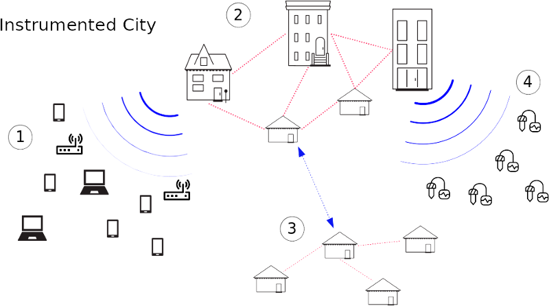

The Instrumented City is a concept for a combined wireless access and sensor network by [Commotion Wireless](https://commotionwireless.net) and [Throneless Tech](https://throneless.tech). It is powered by the [Clatter](https://github.com/commotionwireless/clatter) encrypted network stack.

The Instrumented City is a fully distributed, secure sensor and connectivity platform. An Instrumented City node is an inexpensive multi-radio device running open-source software. Each node is designed to connect to every other node via common radio protocols such as Wi-Fi, Zigbee, LoRa or other technologies.

It is intended to create an easy to use platform for organizations and individuals to contribute and utilize data, thereby connecting communities to environmental and sensor data that was previously unaccessible. This can augment both environmental justice work, and existing community networking efforts, since it brings additional value when constructing networks and building partnerships.

## Concept Diagram

1. Laptops, mobile devices, and other user devices can connect to the Instrumented City network in order to gain internet access when available, and access locally hosted services.
2. A rooftop network of high-powered wireless routers can spread access and connectivity over a wide area.
3. Low-bandwidth network services can be spread to other, further away networks using long-distance wireless protocols like LoRa.
4. LoRa and similar protocols can also be used to connect to an array of network sensors throughout a community, providing valuable data to the community.

> sensor icon by Adnen Kadri from the Noun Project

> modem icon by bezier master from the Noun Project
